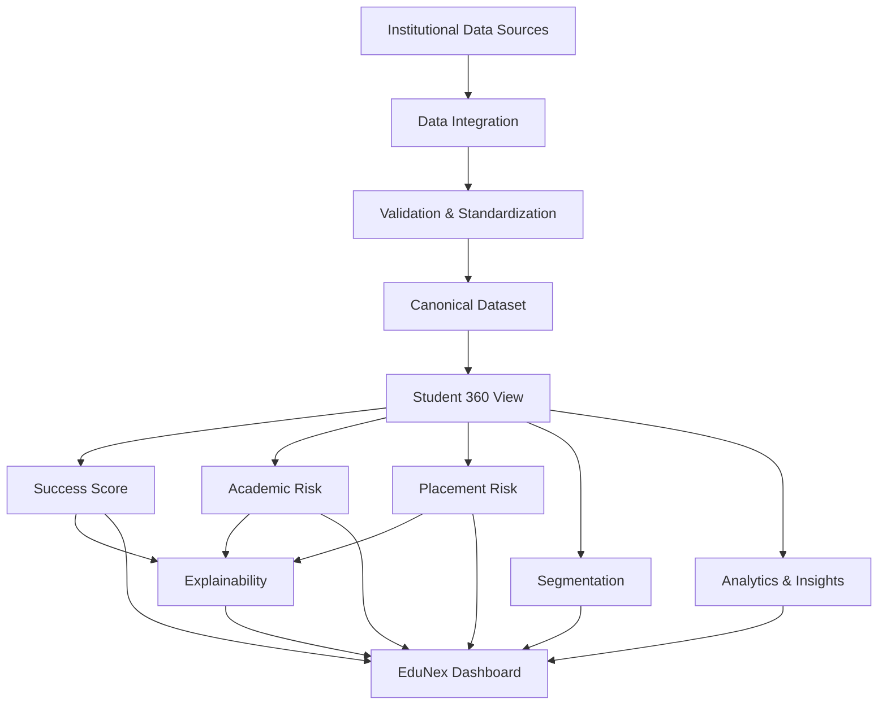

# EduNex

> Smart Campus Analytics: Predict, Understand & Improve Student Success


EduNex is an analytics and AI-powered student success platform developed for the **KPMG in India** challenge: *AI-Powered Student Analytics and Success Platform* (Challenge 4) at the byteXL hackathon. It unifies academic, attendance, LMS, engagement, placement, skills, and feedback data into an explainable Student Success Score, helping institutions identify academic and placement risks and make data-driven decisions.

## Table of Contents
1. [Overview](#1-overview)
2. [Problem Statement](#2-problem-statement)
3. [Solution](#3-solution)
4. [Core Features](#4-core-features)
5. [Student Success Score](#5-student-success-score)
6. [Risk Identification](#6-risk-identification)
7. [Explainability](#7-explainability)
8. [Student Segmentation](#8-student-segmentation)
9. [Analytics & Insights](#9-analytics--insights)
10. [Dashboard Pages](#10-dashboard-pages)
11. [System Architecture](#11-system-architecture)
12. [Technology Stack](#12-technology-stack)
13. [Data Methodology](#13-data-methodology)
14. [Responsible-Use Limitations](#14-responsible-use-limitations)
15. [How to Run Locally](#15-how-to-run-locally)
16. [Deployment](#16-deployment)
17. [Repository Structure](#17-repository-structure)
18. [Testing & Quality](#18-testing--quality)
19. [Dataset & Provenance Transparency](#19-dataset--provenance-transparency)
20. [License](#20-license)

---

## 1. Overview

Educational institutions often have student information distributed across multiple areas:
- Academic performance
- Attendance
- LMS activity
- Engagement
- Placement readiness
- Skills
- Feedback

This fragmentation makes it difficult to obtain a unified view of student success. EduNex brings these domains together into a unified analytical view. The platform helps administrators:

- Understand student performance
- Identify academic risk
- Identify placement risk
- Understand score drivers
- Discover meaningful student segments
- Analyze trends
- Make data-informed decisions

*(Note: EduNex is a descriptive and analytical platform. It does not automatically determine a student's future or mandate automated decisions.)*

---

## 2. Problem Statement

**Smart Campus Analytics: Predict, Optimize & Improve Student Success**

The core problem in higher education is disconnected silos of information. Without integrated analytics, institutions struggle to identify at-risk students before critical academic or placement deadlines.

EduNex establishes a comprehensive analytical pipeline:

```
Raw student data
        ↓
Data integration
        ↓
Unified Student View
        ↓
Domain normalization
        ↓
Student Success Score
        ↓
Risk identification
        ↓
Explainability
        ↓
Segmentation
        ↓
Interactive analytics
        ↓
Institutional decision support
```

---

## 3. Solution

EduNex integrates seven fundamental domains using a unique `student_id` to establish the institutional analytical model:

| Domain | Example indicators |
|---|---|
| Academic | CGPA, internal marks, backlogs, subject performance |
| Attendance | Overall and subject attendance |
| LMS | Login frequency, assignment completion |
| Engagement | Events, clubs, hackathons, certifications |
| Placement | Aptitude, coding, mock interview, participation |
| Skills | Technical and soft skills |
| Feedback | Student satisfaction, faculty feedback |

---

## 4. Core Features

### Data Integration
Normalizes distributed silos into a unified canonical dataset encompassing seven different activity domains.

### Unified Student View
A comprehensive **Student 360** profile that provides an instantaneous, complete picture of a student’s campus life.

### Student Success Score
An explainable composite score combining normalized domain scores into a single metric for student success.

### Academic Risk
Evaluates traditional academic indicators to highlight students falling behind core academic requirements.

### Placement Risk
Evaluates placement-readiness indicators (aptitude, coding, mock interviews) to assess career risk.

### Explainable Score
Empowers users to fully understand:
- Domain value
- Effective weight
- Score contribution
- Available/missing signals
- Risk drivers
- Protective indicators

### Student Segmentation
Assigns students to predefined, actionable analytical segments to power cohort analysis.

### Interactive Dashboard
A rich, fast, and fully responsive SPA dashboard offering insights into Overview, Students, Risks, Segments, Insights, and Data endpoints.

---

## 5. Student Success Score

The success score combines different dimensions to evaluate overall institutional success. 

| Domain | Weight |
|---|---:|
| Academic | 25% |
| Attendance | 15% |
| LMS | 15% |
| Engagement | 10% |
| Placement | 20% |
| Skills | 10% |
| Feedback | 5% |
| **Total** | **100%** |

**Formula:**
> Success Score = (Academic × 0.25) + (Attendance × 0.15) + (LMS × 0.15) + (Engagement × 0.10) + (Placement × 0.20) + (Skills × 0.10) + (Feedback × 0.05)

*All domains are normalized to a 0–100 scale before calculation.*

**Missing-Data Behavior:**  
If certain domains are unavailable, the available weights are mathematically **renormalized**. EduNex never punishes a student for missing data.

**Score Bands:**
| Score | Band |
|---:|---|
| 80–100 | Excellent |
| 65–79 | Good |
| 50–64 | Moderate |
| 0–49 | Needs Attention |

> **Important:** These weights and thresholds are analytical defaults defined for the EduNex prototype and are not KPMG policy or institutional policy.

---

## 6. Risk Identification

### Academic Risk
Evaluates current performance against baseline expectations using the latest relevant academic period:

| Signal | Weight |
|---|---:|
| CGPA | 25% |
| Internal Marks | 20% |
| Backlogs | 20% |
| Subject Performance | 15% |
| Attendance | 10% |
| LMS Activity | 5% |
| Assignment Completion | 5% |

**Risk Bands:**
- **LOW:** 0–29
- **MEDIUM:** 30–59
- **HIGH:** 60–100

### Placement Risk
Converts placement-readiness signals into risk values to identify students struggling with career preparation:

| Signal | Weight |
|---|---:|
| Aptitude | 20% |
| Coding | 25% |
| Mock Interview | 20% |
| Technical Skills | 15% |
| Soft Skills | 10% |
| Placement Participation | 10% |

*(These indicators reflect readiness and are not guaranteed placement predictions.)*

---

## 7. Explainability

EduNex uses deterministic score explanations, providing full transparency over mathematical calculations rather than opaque AI inferences.

**Score Conceptual Flow:**
```
Domain value
      ↓
Normalization
      ↓
Effective weight
      ↓
Contribution
      ↓
Overall score
```

**Risk Conceptual Flow:**
```
Signal
      ↓
Normalized risk contribution
      ↓
Risk drivers / protective indicators
      ↓
Overall risk
```

> **Important:** The explanation describes how the implemented analytical score is constructed. It does not establish causal relationships.

---

## 8. Student Segmentation

The platform implements six distinct analytical segments:
1. `HIGH_ACADEMIC_HIGH_PLACEMENT`
2. `HIGH_ACADEMIC_LOW_PLACEMENT`
3. `LOW_ACADEMIC_HIGH_PLACEMENT`
4. `LOW_ACADEMIC_LOW_PLACEMENT`
5. `HIGH_ENGAGEMENT_LOW_ACADEMIC`
6. `LOW_ENGAGEMENT_LOW_ACADEMIC`

**Purpose:**  
Segmentation powers cohort analysis, facilitates targeted institutional attention, helps administrators understand different student profiles, and identifies patterns across academic and placement dimensions. *(A segment does not determine a student's identity or future.)*

---

## 9. Analytics & Insights

The platform visualizes:
- Score trends
- Attendance trends
- Engagement trends
- Risk distributions
- Score distributions
- Cohort comparisons
- Segment distributions

> **Explicit Limitation:** The current implementation provides descriptive and comparative analytics. EduNex does not claim forecasting, causal inference, guaranteed predictions, intervention effectiveness, or automated recommendations.

---

## 10. Dashboard Pages

| Route | Purpose |
|---|---|
| `/dashboard` | Institutional overview |
| `/students` | Student population and filtering |
| `/students/:studentId` | Student 360 profile |
| `/risks` | Academic and placement risk analysis |
| `/segments` | Student segmentation |
| `/insights` | Trends and analytical insights |
| `/data` | Data integration, schema, quality and provenance |

---

## 11. System Architecture



---

## 12. Technology Stack

- **Frontend:** React 19, Vite, React Router, Tailwind CSS (v4), shadcn/ui, Recharts
- **Backend:** Python 3.12+, FastAPI, Uvicorn, Pydantic, SQLAlchemy, Alembic
- **Database:** PostgreSQL (via psycopg)
- **Testing:** Vitest, Playwright (Frontend), Pytest (Backend)
- **Data & AI:** Pandas, NumPy, Scikit-learn (for core analytical logic)
- **Infrastructure:** Render (Infrastructure as Code via `render.yaml`)

---

## 13. Data Methodology

EduNex relies on canonical demonstration data. Data from CSV sources is heavily validated, cleansed, and strictly mapped to core schemas using Pydantic validation before being ingested into the PostgreSQL database.

The backend heavily caches analytical groupings and ensures that no unrelated public datasets are dangerously merged via `student_id`.

---

## 14. Responsible-Use Limitations

- **Simulated Data:** The dataset is explicitly labelled as **Demonstration Institutional Dataset — not real institutional data**.
- **No Causal Inferences:** Risk scores highlight correlation and historical patterns, they do not imply causation.
- **Decision Support Only:** EduNex is built as a decision-support system, not an automated adjudicator. Humans must review analytics before enacting academic actions.
- **Readiness vs Guarantee:** Placement indicators are solely readiness metrics, not a guarantee of securing employment.

---

## 15. How to Run Locally

**Requirements:** Node.js (v20+), Python (3.12+), PostgreSQL (16+).

**1. Database Setup:**
Start a local Postgres instance and create a database (e.g., `campuspulse`).

**2. Backend Setup:**
```bash
cd backend
python -m venv .venv
source .venv/bin/activate  # Or .venv\Scripts\activate on Windows
pip install -r requirements.txt
```
Copy `.env.example` to `.env` and set `DATABASE_URL`. Run migrations and ingest data:
```bash
alembic upgrade head
python scripts/run_ingestion.py
```
Start the backend server:
```bash
uvicorn backend.app.main:app --host 127.0.0.1 --port 8000
```

**3. Frontend Setup:**
```bash
cd frontend
npm install
npm run dev
```

---

## 16. Deployment

EduNex is configured exclusively for deployment on **Render** using the included `render.yaml` blueprint.

1. Connect this repository to your Render account.
2. Under "Blueprints", click "New Blueprint Instance" and select this repository.
3. Render will automatically provision:
   - Managed PostgreSQL Database
   - FastAPI Python Web Service (runs Alembic migrations automatically)
   - React + Vite Static Site (with built-in SPA routing rewrites)

---

## 17. Repository Structure

```
edunex/
├── backend/               # FastAPI Python application
│   ├── alembic/           # Database migrations
│   ├── app/               # Core API, Models, Services, Schemas
│   ├── scripts/           # Ingestion & Data generation scripts
│   ├── tests/             # Pytest suite
│   └── requirements.txt   # Python dependencies
├── frontend/              # React SPA
│   ├── src/               # Components, Pages, Routing, Services
│   ├── scripts/           # Playwright verification suites
│   ├── package.json       # Node dependencies
│   └── vite.config.ts     # Vite configuration
├── data/                  # Source CSVs & canonical processed data
├── docs/                  # In-depth architectural & methodology markdown
├── render.yaml            # Render Infrastructure as Code definition
└── README.md              # Project documentation
```

---

## 18. Testing & Quality

EduNex boasts rigorous test coverage ensuring zero regressions during deployment:

- **Frontend Unit/Integration:** `cd frontend && npm test` (Vitest)
- **Frontend E2E Interaction:** `cd frontend && npm run test:browser` (Playwright)
- **Backend Unit/API:** `pytest` (56/56 passing APIs, core scoring modules, schemas)
- **Build Quality:** Strict TypeScript (`tsc --noEmit`) and Vite production builds.

---

## 19. Dataset & Provenance Transparency

EduNex enforces absolute transparency on all processed information. A full Data Dictionary, Quality Report, and Provenance Metadata manifest are available both inside the `docs/` folder and accessible directly through the `/data` route on the live application.

---

## 20. License

This project is submitted for the KPMG India Challenge. Code is provided under standard open-source conventions where applicable. Third-party UI components (shadcn/ui, React Bits, Origin UI) maintain their respective MIT and open-source licenses as documented in `frontend/THIRD_PARTY_NOTICES.md`.
