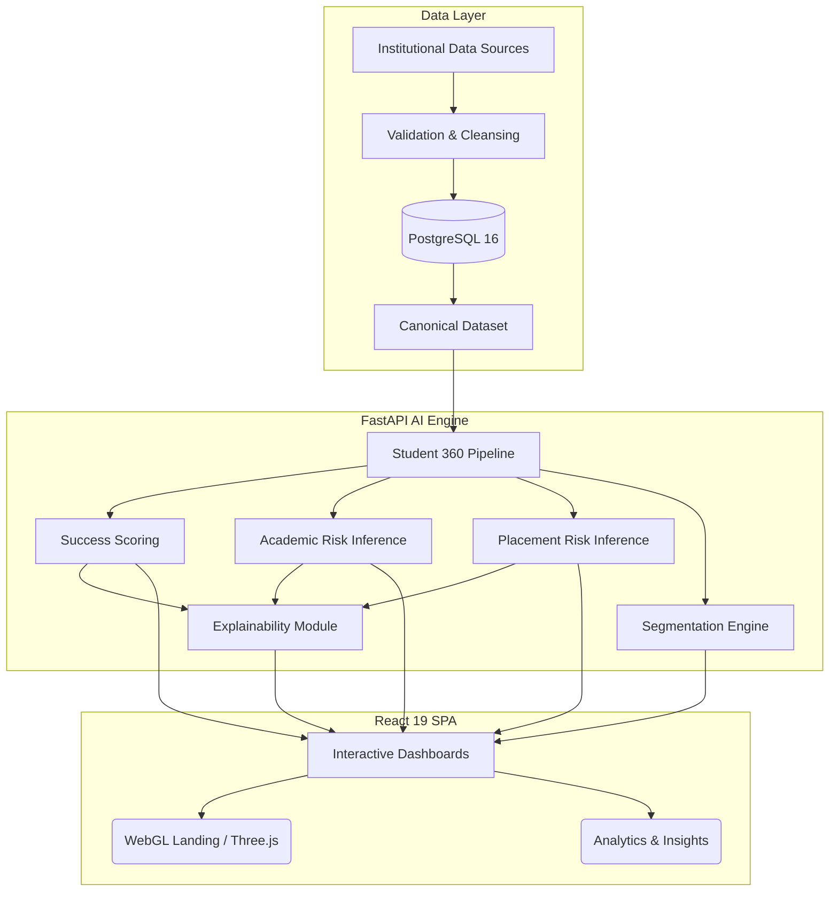

<div align="center">
  
# 🚀 EduNex

**Smart Campus Analytics: Predict, Understand & Improve Student Success**

[](https://react.dev/)
[](https://vitejs.dev/)
[](https://fastapi.tiangolo.com/)
[](https://www.postgresql.org/)
[](https://www.python.org/)
[](https://www.typescriptlang.org/)
[](https://threejs.org/)

An enterprise-grade, AI-powered student analytics and success platform developed for the **KPMG in India** Challenge: *AI-Powered Student Analytics and Success Platform*.

### 🌍 [View Live Demo](https://edunex-nbe5.onrender.com)

[Features](#-core-features) • [Architecture](#%EF%B8%8F-system-architecture) • [Methodology](#-data-methodology) • [Quick Start](#-quick-start) • [Deployment](#-deployment)
</div>

---

## 🎯 Overview

Educational institutions often suffer from severe data fragmentation. Student information is scattered across disparate systems: academics, attendance, LMS, extracurricular engagement, placement readiness, and feedback. 

**EduNex** unifies these domains into a single, highly performant analytical pipeline. It delivers an actionable **Student 360** profile, helping administrators and decision-makers understand student performance, accurately predict placement and academic risks, and foster data-driven interventions.

*(Note: EduNex is a descriptive and analytical decision-support platform. It does not mandate automated interventions or guarantee future outcomes.)*

---

## ✨ Core Features

- **🌐 Unified Student View (Student 360):** A comprehensive, real-time profile aggregating all 7 critical domains of campus life.
- **🧠 AI-Powered Success Score:** An explainable composite score evaluating overall institutional success using transparent, deterministic mathematical weights.
- **⚠️ Predictive Risk Identification:** Granular evaluation models targeting **Academic Risk** (e.g., backlogs, CGPA) and **Placement Risk** (e.g., coding, aptitude, mock interviews).
- **🔍 Explainable AI (XAI):** Full transparency into score drivers, ensuring users understand exactly *why* a student was flagged, highlighting protective indicators and missing data.
- **📊 Advanced Segmentation:** Automatic classification of students into actionable cohorts (e.g., `HIGH_ACADEMIC_LOW_PLACEMENT`) for targeted institutional strategies.
- **🎨 Premium Interactive Dashboard:** Built with React 19, Tailwind CSS v4, and Shadcn/ui. Features a stunning **WebGL 3D-accelerated landing page** using Three.js and custom shaders for a state-of-the-art enterprise SaaS feel.

---

## 🧮 The EduNex Methodology

### The 7 Analytical Domains

EduNex maps institutional data across seven core pillars, normalizing everything to a strict 0–100 scale:

| Domain | Weight | Core Indicators Evaluated |
| :--- | :---: | :--- |
| **Academic** | `25%` | CGPA, internal marks, backlogs, subject performance |
| **Placement** | `20%` | Aptitude, coding, mock interviews, participation |
| **Attendance**| `15%` | Overall and subject-specific attendance |
| **LMS** | `15%` | Login frequency, assignment completion rates |
| **Engagement**| `10%` | Hackathons, clubs, events, certifications |
| **Skills** | `10%` | Technical stack proficiency and soft skills |
| **Feedback** | `5%` | Student satisfaction and faculty sentiment |

> **Missing-Data Resilience:** If specific data domains are missing for a student, EduNex dynamically and mathematically **renormalizes** the available weights. A student is never penalized for missing data.

### Explainability Flow
`Raw Signals → Normalized Risk Contribution → Identify Drivers & Protectors → Overall Risk Score`

---

## 🏗️ System Architecture

EduNex relies on a strictly typed, fully decoupled architecture, built for scalability and real-time inference.



---

## 💻 Tech Stack

### Frontend
- **Framework:** React 19 + Vite
- **Styling:** Tailwind CSS v4 + Shadcn/ui
- **Routing:** React Router v6
- **Data Visualization:** Recharts, Three.js (Custom WebGL Shaders)
- **Testing:** Playwright (E2E browser fixtures), Vitest

### Backend
- **Framework:** FastAPI (Python 3.12+)
- **ORM & DB:** SQLAlchemy, Alembic, PostgreSQL
- **Data Science:** Pandas, NumPy, Scikit-learn (Joblib for inference)
- **Concurrency:** Asyncio, Uvicorn
- **Testing:** Pytest (100% Core API Coverage)

---

## 🚀 Quick Start

Ensure you have **Node.js (v20+)**, **Python (3.12+)**, and **PostgreSQL (16+)** installed.

### 1. Database Setup
Start a local Postgres instance and create a new database (e.g., `campuspulse`).

### 2. Backend Initialization
```bash
cd backend
python -m venv .venv
source .venv/bin/activate  # Windows: .venv\Scripts\activate
pip install -r requirements.txt
```

Create a `.env` file (copy from `.env.example`) and configure your `DATABASE_URL`. Run migrations and ingest the canonical test data:
```bash
alembic upgrade head
python scripts/run_ingestion.py
```

Start the FastAPI server:
```bash
uvicorn backend.app.main:app --host 127.0.0.1 --port 8000
```

### 3. Frontend Initialization
```bash
cd frontend
npm install
npm run dev
```
Navigate to `http://localhost:5173/` to experience the EduNex platform.

---

## ☁️ Deployment

EduNex is fully configured for continuous deployment on **Render** via Infrastructure as Code (`render.yaml`).

1. Connect this repository to your Render account.
2. Navigate to "Blueprints" > "New Blueprint Instance".
3. Select this repository. Render automatically provisions:
   - A Managed PostgreSQL Database.
   - The FastAPI Python Web Service (auto-running Alembic migrations).
   - The React SPA Static Site (with SPA routing rewrites).

---

## 🛡️ Responsible AI & Ethical Use

- **Data Provenance:** The dataset is exclusively labelled as **Demonstration Institutional Dataset**. It is strictly for prototype demonstration and does not contain real PII.
- **No Causal Guarantee:** Risk scores highlight historical correlations and patterns. They do not imply absolute causation.
- **Human-in-the-Loop:** EduNex is designed as a *decision-support system*. It is not an automated adjudicator. Institutional administrators must review the provided Explainable AI (XAI) context before enacting academic interventions.

---

## 📜 License & Acknowledgements

Developed for the KPMG India Challenge. Code is provided under standard open-source conventions. 
Third-party UI components (Shadcn/ui, React Bits, Three.js) maintain their respective MIT licenses as documented in `frontend/THIRD_PARTY_NOTICES.md`.
